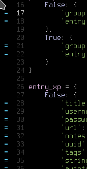

# Doom Emacs

- Characters to left of line numbers when writing file
    
- Parenthesis completion in search-replace dialog
- No shortcut for uncommenting selected lines
- Annoying completion on for every mode 
  - (starting "look" process)
- adding packages is complicated.  not like spacevim/spacemacs where you add a single line to config
  - e.g.
  ;; in ~/.doom.d/packages.el
  (package! ttl-mode
    :recipe (:host github :repo "jeeger/ttl-mode"))

  ;; in ~/.doom.d/config.el
  (use-package! ttl-mode
    :mode "\\.n3$"
    :mode "\\.ttl$")
    
- autoindent of selected region doesn't work
- colon automatically inserted when defining function.  why?
  - wouldn't be as much of a problem if I didn't have to leave edit mode to move cursor around it
  
- syntax checking -> disable flycheck-mode

- none of the modes respect tab-width, they all define their own variable
